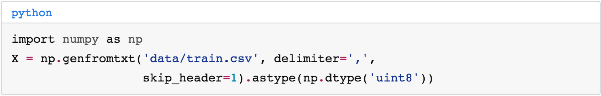

# highlight_plus
An extension of the highlight tag in Jekyll.

There is one feature: language names get added to the top of the code blocks.

## Installation

Add `highlight_plus.rb` to the `_plugins` folder in your Jekyll project.

## Example

```css
.highlight>figcaption {
    padding: 2px 2px 2px 12px;
    border: 1px solid #cfcfcf;
    border-bottom: none;
    border-radius: 3px 3px 0px 0px;
    font-family: 'Courier', monospace;
    color: #2a7ae2;
}
.highlight pre {
  border: 1px solid #cfcfcf;
  border-radius: 0px 0px 3px 3px;
  background-color: #f7f7f7;
}
```

with [pygments](https://jekyllrb.com/docs/templates/#code-snippet-highlighting) creates...



You can also add an extra `filename` parameter to replace the language name with whatever you'd like.

```liquid

class Test:
    def __init__(self, x):
        pass

```
